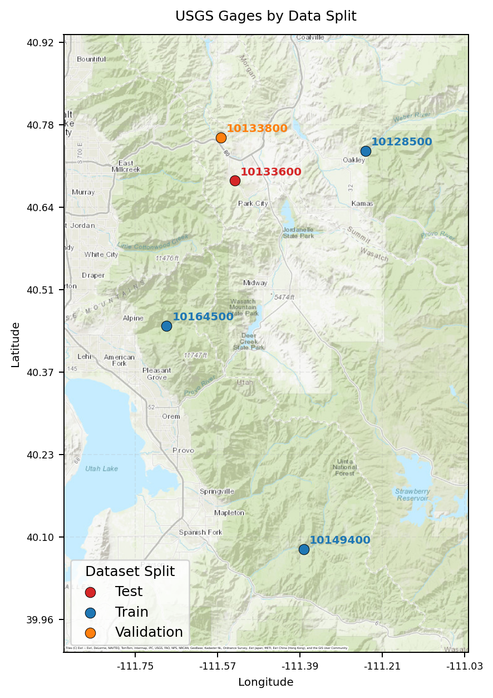

# Streamflow Prediction using LSTM Models

This project uses Python programming, data retrieval, data processing, and visualization—to build and evaluate machine learning models for hydrologic applications. A long short-term memory model is used to predict streamflow by training on a variety of parameters such as SWE, radiation, temperature, and precipitation. Model performance is tested and evaluated. 

### What's here

Data retreival for USGS gage sites of interest is in [the LSTM data script](LSTM_data.ipynb). Building and executing the LSTM model is in [the LSTM script](LSTM.ipynb). 

### Sites

Five USGS gage sites were used for training, validating, and testing the LSTM model: 

- Diamond Fork Abv Red Hollow NR Thistle, UT - USGS-[10149400](https://waterdata.usgs.gov/monitoring-location/USGS-10149400/#period=P7D&dataTypeId=continuous-00060-0&showMedian=true&showFieldMeasurements=true)
- American FK AB Upper Powerplant NR American Fk, UT - USGS-[10164500](https://waterdata.usgs.gov/monitoring-location/USGS-10164500/#period=P365D&dataTypeId=continuous-00060-0&showMedian=true&showFieldMeasurements=true)
- Weber River Near Oakley, UT - USGS-[10128500](https://waterdata.usgs.gov/monitoring-location/USGS-10128500/#period=P7D&dataTypeId=continuous-00060-0&showMedian=true&showFieldMeasurements=true)
- East Canyon Creek Near Jeremy Ranch, UT - USGS-[10133800](https://waterdata.usgs.gov/monitoring-location/USGS-10133800/#period=P7D&dataTypeId=continuous-00060-0&showMedian=true&showFieldMeasurements=true)
- Mcleod Creek Near Park City, UT - USGS-[10133600](https://waterdata.usgs.gov/monitoring-location/USGS-10133600/#period=P7D&dataTypeId=continuous-00060-0&showMedian=true&showFieldMeasurements=true)

